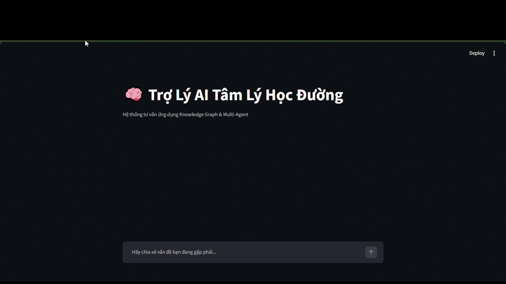

# Student Laziness Cause Analysis using Knowledge Graph and Multi-Agent System

> A Vietnamese AI assistant system that analyzes the root causes of student laziness using Knowledge Graph, Neo4j, LangGraph Multi-Agent workflow, and Google Gemini.

## Overview

This project builds an AI-powered school counseling assistant that helps analyze why students feel lazy, unmotivated, or avoid studying.

Instead of giving generic advice, the system uses a Knowledge Graph to trace possible cause-effect chains behind the student's statement. The system then generates a more grounded and empathetic response based on the retrieved graph evidence.

Example:

```txt
Input:
"Dạo này tôi cảm thấy khá lười học, trì hoãn các hoạt động cá nhân và chỉ muốn nằm dài lướt toptop."

Possible graph reasoning:
Mạng xã hội → Xao nhãng → Giảm thời gian học
Mất hứng thú / Game online → Trì hoãn → Lười học
```
## Demo


## System Architecture
The system contains the following main components:

- **Streamlit Frontend**: provides a simple chat interface for students.
- **LangGraph Workflow**: controls the multi-agent reasoning flow.
- **Google Gemini**: powers natural language understanding and response generation.
- **Neo4j Knowledge Graph**: stores cause-effect relationships between psychological and behavioral issues.
- **Cypher Query Generation**: converts natural language input into graph queries.

## Multi-Agent Workflow
The system is divided into four main agents:
| Agent      | Role                                                 |
| ---------- | ---------------------------------------------------- |
| Router     | Classifies user intent                               |
| Cypher_Gen | Generates Cypher query from natural language         |
| Graph_Exec | Executes query on Neo4j                              |
| Counselor  | Generates empathetic response based on graph results |

## Knowledge Graph Design

The graph uses the following main node label: ```(:VanDe)```

Each node represents a psychological, behavioral, or academic issue.

Example nodes:

```bash
Lười học
Xao nhãng
Trì hoãn
Mạng xã hội
Thiếu nền tảng kiến thức
Cảm giác bất lực
```

Example relationships:
```bash
(:VanDe)-[:GAY_RA]->(:VanDe)
(:VanDe)-[:DAN_DEN]->(:VanDe)
(:VanDe)-[:LAM_TANG]->(:VanDe)
(:VanDe)-[:LAM_GIAM]->(:VanDe)
(:VanDe)-[:BIEU_HIEN_THANH]->(:VanDe)
```

## Project Structure
```bash
student-laziness-kg-multi-agent/
│
├── README.md
├── requirements.txt
├── .gitignore
├── .env.example
│
├── src/
│   └── graph_agent.py
│
├── database/
│   └── graph_study.cypher
│
└── assets/
    ├── demo.gif
    └── architecture.png
```

## Installation
### 1. Clone the repository
```bash
git clone https://github.com/your-username/student-laziness-kg-multi-agent.git
cd student-laziness-kg-multi-agent
```

### 2. Create virtual environment
```bash
python -m venv venv
venv\Scripts\activate
```

### 3. Install dependencies
```bash
pip install -r requirements.txt
```

### 4. Configure environment variables
Create a `.env` file from `.env.example`:
```bash
copy .env.example .env
```

Then update your real API keys and Neo4j credentials:
```bash
GOOGLE_API_KEY=your_google_gemini_api_key
NEO4J_URI=bolt://localhost:7687
NEO4J_USERNAME=neo4j
NEO4J_PASSWORD=your_neo4j_password
```

### Setup Neo4j Database
Open Neo4j Browser and run the Cypher script in:
```bash
database/graph_study.cypher
```
This script creates the Knowledge Graph containing cause-effect relationships related to student laziness.

### Run the Application
```bash
streamlit run src/graph_agent.py
```
Then open the local Streamlit URL in your browser.

### Example Query
```bash
Dạo này tôi cảm thấy khá lười học, trì hoãn các hoạt động cá nhân và chỉ muốn nằm dài lướt toptop.
```

Expected reasoning result:
```bash
Mạng xã hội → Xao nhãng → Giảm thời gian học
Mất hứng thú / Game online → Trì hoãn → Lười học
```

### Technologies Used
- Python
- Streamlit
- Neo4j
- Cypher
- LangGraph
- LangChain
- Google Gemini
- Knowledge Graph
- GraphRAG

### Future Improvements
- Add Hybrid GraphRAG with Vector Database for semantic matching.
- Allow the system to learn new cause-effect relationships automatically.
- Improve the counseling response with more personalized intervention strategies.
- Deploy the app online for real users.